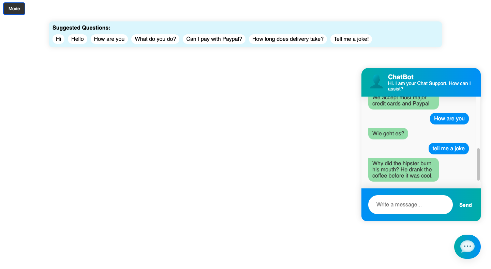
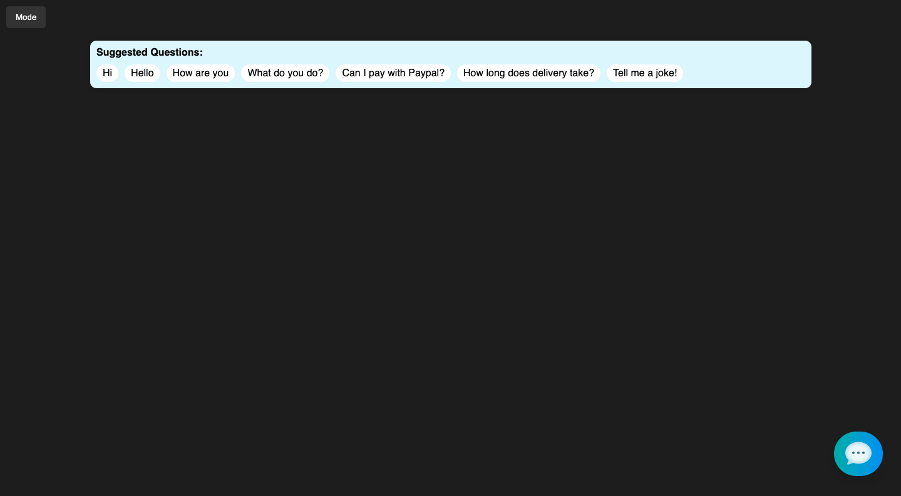

# ChatBot Deployment Guide

### Create, train, and deploy a chatbot using PyTorch, NLTK, and an API for user interaction.



## Table of Contents
1. [Set Up and Pre-Processing](#set-up-and-pre-processing)
2. [Model Definition and Training](#model-definition-and-training)
3. [Model Evaluation and Response Generation](#model-evaluation-and-response-generation)
4. [API Deployment and Frontend Integration](#api-deployment-and-frontend-integration)
5. [Integration with React and Firebase](#integration-with-react-and-firebase)

## Set Up and Pre-Processing

1. **Dependencies**: 
   ```
   pip install torch nltk
   ```

Tokenization: Use nltk to tokenize your input sentences for training.

# Model Definition and Training
1. Define your neural network model in model.py.
2. Use train.py to:
- Load intents from intents.json.
- Extract patterns and create a vocabulary.
- Train the model.
- Save the model to newdata.pth.
# Model Evaluation and Response Generation
1. In chat.py:
- Load the trained model.
- Define a get_response function to get responses.
# API Deployment and Frontend Integration
1. Set up a Flask or FastAPI server.
2. Create an API endpoint for user input and get the chatbot's response.
3. Frontend:
- Use HTML template.
- Add interactivity with the provided JavaScript.
# Integration with React and Firebase
1. React:
- Create a React component for the chat interface.
- Use axios or fetch to communicate with the Flask API.
  
# Firebase Deployment:

## Deploy Flask App Using Firebase Cloud Functions

### **Precondtitions**:
- Firebase CLI installed: 
    ```bash
    npm install -g firebase-tools
    ```
- Firebase project setup.

### **Steps**:

1. **Initialize Firebase Functions**:
    ```console
    firebase init functions
    ```
   Choose Python as your runtime.

2. **Setting up Flask in the Functions**:
    - Navigate to the `functions` folder.
    - Install Flask:
      ```bash
      pip install Flask -t ./
      ```
      (The -t ./ argument tells pip to install the package in the current directory so that Firebase can find it.)

    - Create a `main.py`:

      ```python
      from flask import Flask, request
      from chatbot import get_response  # Assuming your chat functionality is in chatbot.py
      from flask_cors import CORS #Cross-origin resource sharing
      
      app = Flask(__name__)
      CORS(app)

      @app.route('/predict', methods=['POST'])
      def chatbot_response():
          message = request.json['message']
          response = get_response(message)
          return {'response': response}

      if __name__ == "__main__":
          app.run()
      ```

      - Edit the functions/index.js (created by Firebase CLI) to import and use your Flask app:
        
      ```js
      const functions = require('firebase-functions');
      const { app } = require('./main.py');
      exports.app = functions.https.onRequest(app);
      ```

3. **Deploy to Firebase**:
    - In the `functions` directory:
      ```console
      firebase deploy --only functions
      ```

4. Setting up the React Frontend:
- Build your React app. If you created your React app using create-react-app, you can run 'npm run build' to create a production build of your app.
- Copy the contents of the build directory (from your React app) into the public directory that the Firebase CLI created.
- Deploy the React app by running firebase deploy --only hosting.

5. Fetching from React:

- Once deployed, your Flask app will have a URL like https://<region>-<project-id>.cloudfunctions.net/app. You can use this URL in your React app to make fetch requests.

```js
fetch("https://<region>-<project-id>.cloudfunctions.net/app")
  .then(response => response.text())
  .then(data => console.log(data));

```

- Remember to replace <region> and <project-id> with your actual Firebase region and project ID.

- By following these steps, you'll have a Flask app running on Firebase Cloud Functions and a React app hosted on Firebase Hosting. Your React app will communicate with the Flask backend via HTTP requests.


## Containerize Flask App Using Docker

### **Preconditions**:
- Docker installed.

### **Steps**:

1. **Create a Dockerfile**:

```Dockerfile
# Use an official Python runtime as the base image
FROM python:3.8-slim

# Set the working directory in the container to /app
WORKDIR /app

# Copy the current directory contents into the container at /app
ADD . /app

# Install any needed packages specified in requirements.txt
RUN pip install --trusted-host pypi.python.org -r requirements.txt

# Make port 5000 available to the world outside this container
EXPOSE 5000

# Define environment variable
ENV FLASK_APP=your_flask_app_filename.py
ENV FLASK_RUN_HOST=0.0.0.0

# Run your_flask_app_filename.py when the container launches
CMD ["flask", "run"]
```

- Ensure `requirements.txt` is present in the same directory. You can generate one using pip freeze > requirements.txt.

2. **Build Docker Image**:
    ```console
    docker build -t flask-app-name .
    ```

3. **Run Flask Inside Docker**:
    ```console
    docker run -p 5000:5000 flask-app-name
    ```

4. **Handle CORS in Flask**:
    - Install Flask-CORS:
      ```console
      pip install Flask-CORS
      ```

    - Implement in your Flask app:
      ```python
      from flask_cors import CORS

      app = Flask(__name__)
      CORS(app)
      ```
    - In your React app, make requests to http://localhost:5000 (or wherever your Flask app is running).

5. (Optional) Deploying the Dockerized Flask App:
- If you decide to deploy your Dockerized Flask app to a server, you can use platforms like Google Cloud Run, AWS ECS, or any other container orchestration service.

- When you're ready to deploy, you'd typically:

- - Push your Docker image to a container registry (like Docker Hub or Google Container Registry).
- - Deploy the container to your chosen platform.
- - Remember to adjust the URLs in your React app accordingly.

### Note: Always ensure you secure your applications appropriately, especially when deploying to production. This includes using HTTPS, ensuring CORS is configured securely, and following best practices for both Flask and React development.

---

Note: Adjust configurations, file paths, and URLs based on your specific project.

## Firebase Realtime Database:
1. Configure Firebase SDK in your Flask app.
2. Store and retrieve chat logs in the Firebase Realtime Database.
## Tips
- Adjust the training data in intents.json for different use-cases. 
- Add different css styling & js effect

# Integrate ChatBot into React ChatApp
[](https://link_to_subrepo)
- ...
