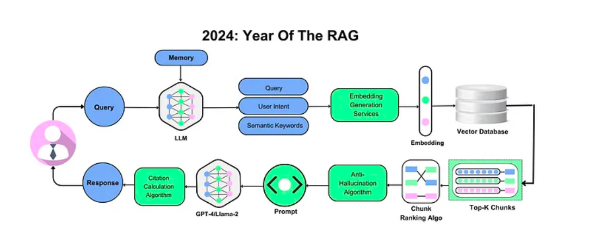
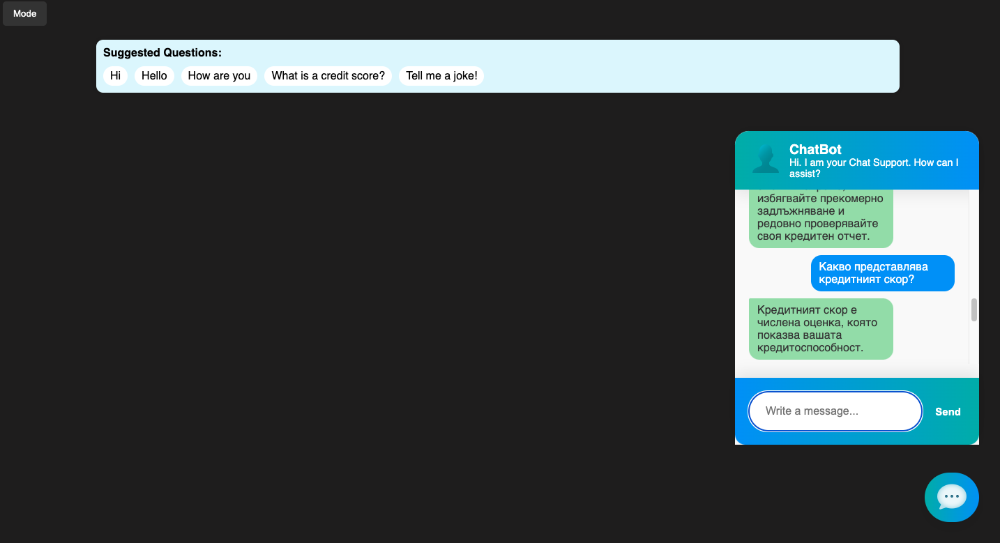
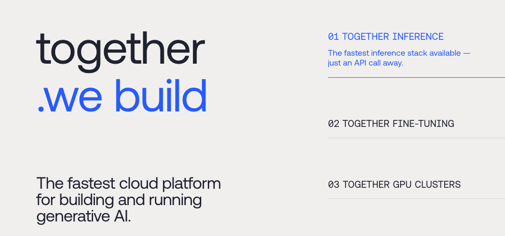
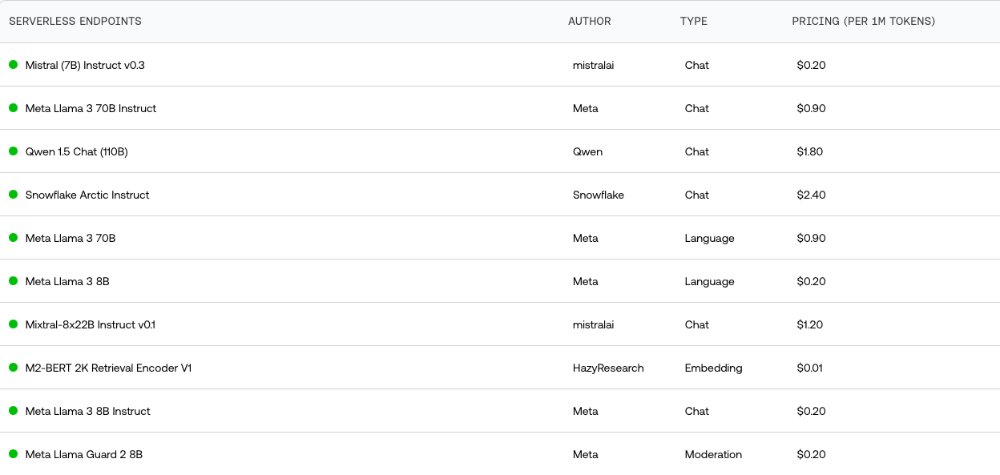
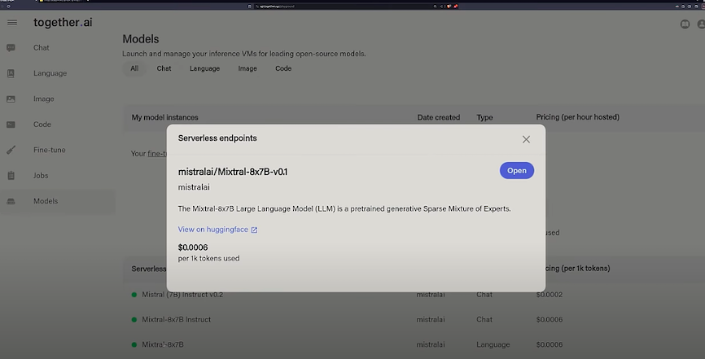
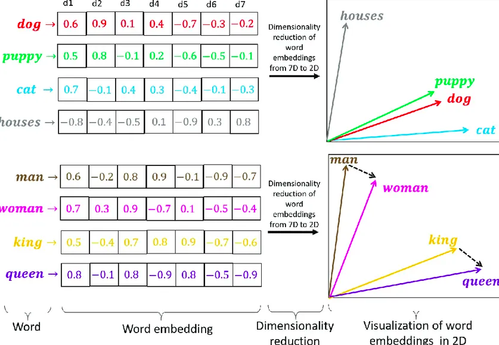
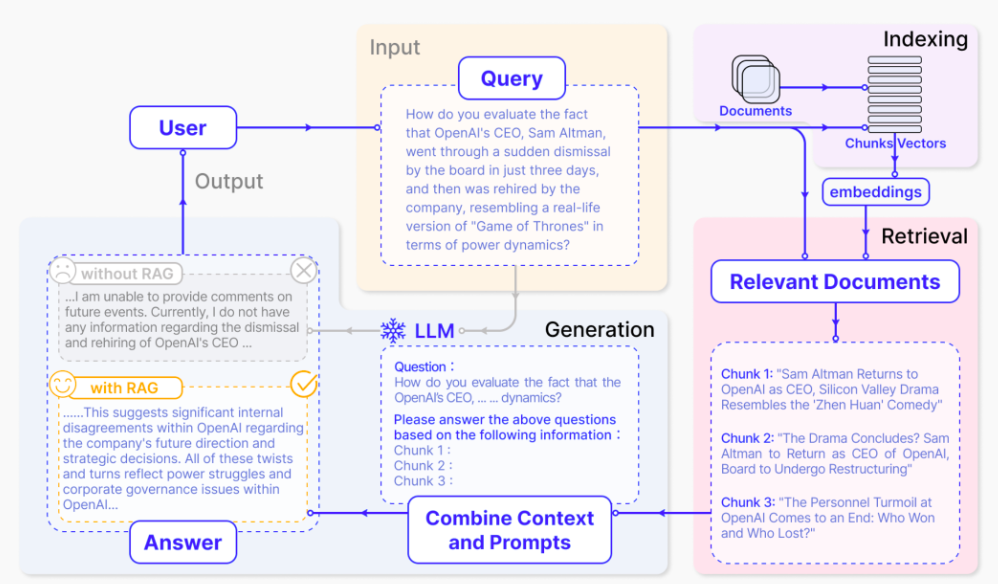
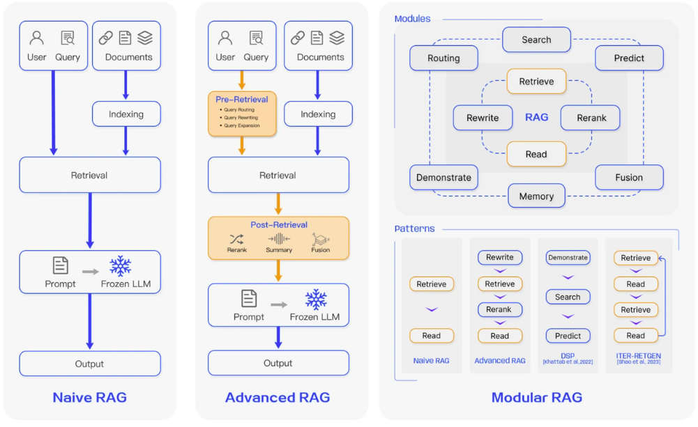
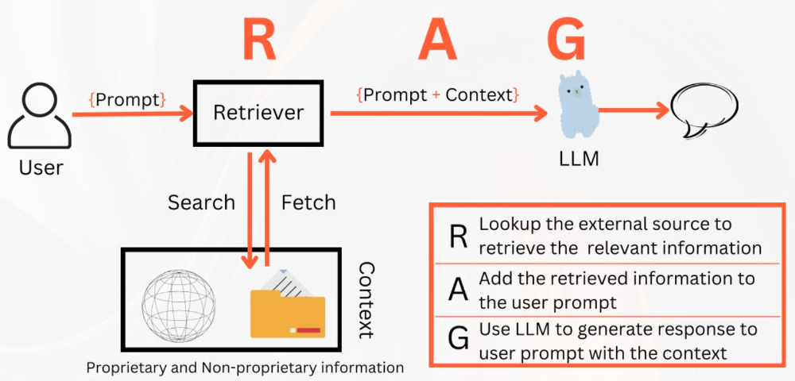

[chatmodels](chatmodels.png)

# RAG models are the best!
## RAG is a way to get responses from LLMs like ChatGPT while supplying your own data.
### Here you can see a few different chatbot implementations along with their pros and cons



## NLTK Hard-Coded Intends Driven Chatbot: uses predefined rules and the Natural Language Toolkit lib. to respond to specific user keywords. (cheapest approach)



## Fine-Tuned Transformer Model: A transformer model that has been trained on additional data/examples to improve its performance on specific tasks. Suggested is to use cheap cloud platform like Togheter.ai for best performance, unless you have a good GPU /cuda/ (CPU usage is not recommended - too slow)







## Enhancing a GPT model with word embeddings.
- Recommendation:
- - freeze model parameters and use pretrained model feeding it with your dataset to embbed context

### Visualisation of the words as vector-neighbors



## Retrieval-Augmented Generation (RAG) approach for best performance, using a custom dataset for improved context and relevancy. This has the best of both words, because it doesn't need too much compute power and also can be modified to fit the use case.







## Or ofc you can simply use OpenAI's platform to dynamically incorporate and update external data in formats like CSV to optimize contextuality and relevance in model responses.

## Simple example usage of pretrained model on HuggingFace that is to be used on a cloud like Together.ai
### DialoGPT is a State-of-the-Art large-scale pretrained dialogue response generation model for multiturn conversations.
- The model is trained on 147M multi-turn dialogue from Reddit discussion thread.
- Simple usage:
```
from transformers import AutoModelForCausalLM, AutoTokenizer
import torch

tokenizer = AutoTokenizer.from_pretrained("microsoft/DialoGPT-large")
model = AutoModelForCausalLM.from_pretrained("microsoft/DialoGPT-large")

# Let's chat for 5 lines
for step in range(5):
    # encode the new user input, add the eos_token and return a tensor in Pytorch
    new_user_input_ids = tokenizer.encode(input(">> User:") + tokenizer.eos_token, return_tensors='pt')

    # append the new user input tokens to the chat history
    bot_input_ids = torch.cat([chat_history_ids, new_user_input_ids], dim=-1) if step > 0 else new_user_input_ids

    # generated a response while limiting the total chat history to 1000 tokens, 
    chat_history_ids = model.generate(bot_input_ids, max_length=1000, pad_token_id=tokenizer.eos_token_id)

    # pretty print last ouput tokens from bot
    print("DialoGPT: {}".format(tokenizer.decode(chat_history_ids[:, bot_input_ids.shape[-1]:][0], skip_special_tokens=True)))
```

### Check out the src code in the dedicated dirs