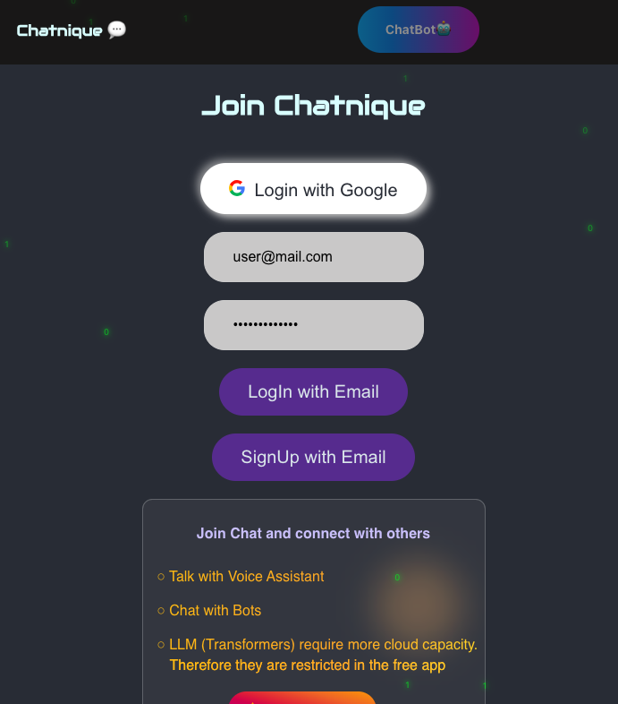

# ChatApp
- Powered by React ChatApp with integrated Chatbot/VoiceAssistant and secure LogIn
- Voice Assistant in python (using LLMs + custom commands)
- ChatBot - ManualSet & API with Open Source LLM (DialoGPT (Hugging face🤗))



## Structure and features of the App:
- Authentication: Utilizes Firebase Authentication to manage user login sessions. It supports Google login and email/password-based authentication.
- Real-time Chat room: Uses Firebase Firestore to store and retrieve chat messages in real-time and keep the chat history for members of the chatnique displaying their avatars as well (all data is protected on google firestore).
- Chatbot Integration: Integrates a chatbot interface that interacts with a Python backend using Axios for secure HTTP requests. The backend is expected to process user input and return responses that are generated from the transformer.
- Dynamic UI Themes: Supports toggling between light and dark themes.
- Responsive UI
- Matrix Rain Effect: A visual effect displayed on the authentication screen, created by dynamically adding "raindrop" 1s & 0s elements to the DOM.
- Scalable: Able to implement larger LM but on the cloud -> paid


### Init:
```
npx create-react-app chatapp
npm start
sudo npm install -g firebase-tools
firebase login
firebase init
```
- Select Hosting.
- Select the project you want to link.
- Set your build folder as your public directory.
- Configure as a single-page app by answering yes to the question.

- Build for prod and deploy:
```
npm run build
firebase deploy
```
- Use the URL from the server to fetch:
```
const response = await fetch(`https://your-flask-api.com/dialogpt`);
```

- For free server:

Install the Heroku CLI.
```
curl https://cli-assets.heroku.com/install.sh | sh
heroku login

heroku create your-app-name

$ cd my-project/
$ git init
$ heroku git:remote -a chatbot-server0
$ git add .
$ git commit -am "make it better"
$ git push heroku master
```
For existing repositories, simply add the heroku remote
```
$ heroku git:remote -a chatbot-server0
```

- If Heroku cannot detect your app's language automatically, you can manually specify a buildpack with the heroku buildpacks:set command. Since you're deploying a Flask app, you should set the Python buildpack:
```
heroku buildpacks:set heroku/python -a chatbot-server0

pip freeze > requirements.txt -> to save all the dependencies of the app
```
- CREATE Procfile in the root dir of the app
with-->     web: gunicorn app:app

- Commit and push your changes:
```
git add requirements.txt Procfile in HEROCU ITS WITH -AM 
git commit -am "Add Heroku deployment files"

And finally Push:
git push heroku master:main
or
git push heroku master:main
```
- Test Locally:
```
heroku local web
```

## Python Server Back-End:

```
from flask import Flask, request, jsonify
from transformers import AutoModelForCausalLM, AutoTokenizer
from flask_cors import CORS

app = Flask(__name__)
CORS(app)  # This will enable CORS for all routes
tokenizer = AutoTokenizer.from_pretrained("microsoft/DialoGPT-small")
model = AutoModelForCausalLM.from_pretrained("microsoft/DialoGPT-small")


@app.route('/')
def home():
    return 'Hello World locally'

@app.route('/generate-text', methods=['POST'])
def generate_text():
    text = request.json['text']
    input_ids = tokenizer.encode(text + tokenizer.eos_token, return_tensors='pt')
    response_ids = model.generate(input_ids, max_length=1000, pad_token_id=tokenizer.eos_token_id)
    response = tokenizer.decode(response_ids[:, input_ids.shape[-1]:][0], skip_special_tokens=True)
    return jsonify({'response': response})

if __name__ == '__main__':
    app.run(debug=True, port=5001)  # Run on a different port (e.g., 5001)

#Ngrok tunnel each time we restart the server: ngrok http 5001
"""Forwarding                    http://a58c-77-85-36-167.ngrok.io -> localhost:5001
Forwarding                    https://a58c-77-85-36-167.ngrok.io -> localhost:5001

choose the https to prevent issues and blockings from browsers and apps like react with https requests
```


## React ChatApp:

```
// Importing necessary React and Firebase modules along with custom CSS and Axios for HTTP requests
import React, { useRef, useState, useEffect } from 'react';
import './App.css';
import axios from 'axios';
import firebase from 'firebase/compat/app';
import 'firebase/compat/firestore';
import 'firebase/compat/auth';
import 'firebase/compat/analytics';
import { useAuthState } from 'react-firebase-hooks/auth';
import { useCollectionData } from 'react-firebase-hooks/firestore';

// Firebase configuration (replace placeholders with your actual Firebase config)
firebase.initializeApp({
  apiKey: "YOUR_API_KEY",
  authDomain: "YOUR_AUTH_DOMAIN",
  projectId: "YOUR_PROJECT_ID",
  storageBucket: "YOUR_STORAGE_BUCKET",
  messagingSenderId: "YOUR_MESSAGING_SENDER_ID",
  appId: "YOUR_APP_ID",
  measurementId: "YOUR_MEASUREMENT_ID"
});

// Firebase services initialization
const userAuth = firebase.auth();
const database = firebase.firestore();

// Main ChatApp component
function ChatApp() {
  // State hook for toggling the chatbot interface
  const [showChatbot, setShowChatbot] = useState(false);
  // Toggle function to show/hide the chatbot
  const toggleChatbot = () => {
    currentUser ? setShowChatbot(prevState => !prevState) : alert("Please log in first to use the chatbot.");
  };

  // Authentication state using Firebase hook
  const [currentUser] = useAuthState(userAuth);
  // Boolean to check if user is authenticated
  const isInAuthState = !currentUser;
  // State hook for theme management
  const [theme, setTheme] = useState('dark');

  // Function to toggle between light and dark themes
  const toggleTheme = () => {
    const newTheme = theme === 'dark' ? 'light' : 'dark';
    setTheme(newTheme);
  };

  // Matrix rain effect on the authentication window
  useEffect(() => {
    const matrixContainer = document.querySelector(".matrix-rain");
    const numberOfDrops = 30;
    for (let i = 0; i < numberOfDrops; i++) {
      const drop = document.createElement("span");
      drop.innerText = Math.random() > 0.5 ? '0' : '1';
      drop.style.left = `${Math.random() * 100}vw`;
      drop.style.animationDuration = `${Math.random() * 2 + 2}s`;
      drop.style.animationDelay = `${Math.random() * 2}s`;
      drop.classList.add("drop");
      matrixContainer.appendChild(drop);
    }
  }, []);

  // Render function for the ChatApp component
  return (
    <div className="ChatApp" data-theme={isInAuthState ? 'dark' : theme}>
      <header>
        <h1 id='room'>Chatnique 💬</h1>
        <button onClick={toggleChatbot} className={`chatbot-btn ${currentUser ? '' : 'disabled'}`}>ChatBot🤖</button>
        <div className="toggle-switch">
          <label className="switch-label" style={{ opacity: isInAuthState ? 0 : 1 }}>
            <input type="checkbox" className="checkbox" onChange={toggleTheme} />
            <span className="slider"></span>
          </label>
        </div>
        {currentUser && <Logout />}
      </header>
      
      {isInAuthState && <div className="matrix-rain"></div>}
      
      <section>
        {showChatbot ? <ChatBotInterface /> : (currentUser ? <ChatInterface /> : <Authentication />)}
      </section>
    </div>
  );
}

// Authentication component for handling user login/signup
function Authentication() {
  // Function for Google login using Firebase Auth
  const googleLogin = () => {
    const provider = new firebase.auth.GoogleAuthProvider();
    userAuth.signInWithPopup(provider);
  };

  // State hooks for managing email/password input
  const [userEmail, setUserEmail] = useState('');
  const [userPass, setUserPass] = useState('');

  // Email login function
  const emailLogin = async () => {
    try {
      await userAuth.signInWithEmailAndPassword(userEmail, userPass);
    } catch (err) {
      console.error("Error with email login:", err);
    }
  };

  // Email signup function
  const emailSignup = async () => {
    try {
      await userAuth.createUserWithEmailAndPassword(userEmail, userPass);
    } catch (err) {
      console.error("Error with email signup:", err);
    }
  };

  // Modal state for contact form
  const [showModal, setShowModal] = useState(false);

  // Render function for the Authentication component
  return (
    
    <div className="auth-section">
      <h1 id='join'>Join Chatnique</h1>
      <button className="auth-btn" onClick={googleLogin}>
      <svg id='google' xmlns="http://www.w3.org/2000/svg"  width="18" height="18" viewBox="0 0 18 18" fill="none" role="img" class="icon ">
<path fill-rule="evenodd" clip-rule="evenodd" d="M17.64 9.20419C17.64 8.56601 17.5827 7.95237 17.4764 7.36328H9V10.8446H13.8436C13.635 11.9696 13.0009 12.9228 12.0477 13.561V15.8192H14.9564C16.6582 14.2524 17.64 11.9451 17.64 9.20419Z" fill="#4285F4"></path>
<path fill-rule="evenodd" clip-rule="evenodd" d="M8.99976 18C11.4298 18 13.467 17.1941 14.9561 15.8195L12.0475 13.5613C11.2416 14.1013 10.2107 14.4204 8.99976 14.4204C6.65567 14.4204 4.67158 12.8372 3.96385 10.71H0.957031V13.0418C2.43794 15.9831 5.48158 18 8.99976 18Z" fill="#34A853"></path>
<path fill-rule="evenodd" clip-rule="evenodd" d="M3.96409 10.7098C3.78409 10.1698 3.68182 9.59301 3.68182 8.99983C3.68182 8.40664 3.78409 7.82983 3.96409 7.28983V4.95801H0.957273C0.347727 6.17301 0 7.54755 0 8.99983C0 10.4521 0.347727 11.8266 0.957273 13.0416L3.96409 10.7098Z" fill="#FBBC05"></path>
<path fill-rule="evenodd" clip-rule="evenodd" d="M8.99976 3.57955C10.3211 3.57955 11.5075 4.03364 12.4402 4.92545L15.0216 2.34409C13.4629 0.891818 11.4257 0 8.99976 0C5.48158 0 2.43794 2.01682 0.957031 4.95818L3.96385 7.29C4.67158 5.16273 6.65567 3.57955 8.99976 3.57955Z" fill="#EA4335"></path>
</svg>
        Login with Google</button>
      <div className="email-auth">
        <input id='email' type="email" value={userEmail} onChange={e => setUserEmail(e.target.value)} placeholder="Email" />
        <input id='pass' type="password" value={userPass} onChange={e => setUserPass(e.target.value)} placeholder="Password" />

        <button id='signinself' onClick={emailLogin} disabled={!userEmail || !userPass}>
          LogIn with Email
        </button>
        <button id='signinself' onClick={emailSignup} disabled={!userEmail || !userPass}>
          SignUp with Email
        </button>

      </div>


      <div className="golden-gradient-container">
        <div className="box">
          <p>Join Chat and connect with others</p> 
          <ul className="golden-gradient-list">
            <li>
              <span>○ Talk with Voice Assistant</span>
            </li>
            <li>
              <span>○ Chat with Bots</span>
            </li>
            <li>
              <span>○ LLM (Transformers) require more cloud capacity.</span>
            <div class="indented-text">Therefore they are restricted in the free app</div>
            </li>
          </ul>


          <button class="ai_btn" onClick={() => setShowModal(true)}>
    <svg viewBox="0 0 36 24" xmlns="http://www.w3.org/2000/svg">
        <path d="m18 0 8 12 10-8-4 20H4L0 4l10 8 8-12z"></path>
    </svg>
    Unlock LLM AI
</button>

        </div>
      </div>
    </div>
  )
}


function ContactModal({ onClose }) {
  return (
      <div className="modal-overlay">
          <div className="modal">
              <button onClick={onClose} className="close-btn">X</button>
              <form className="contact-form">
                  <span className="title">Contact us</span>
                  <p className="description">Large Language models have more parameters and overall better performance. To learn more about pricing...</p>
                  <div>
                      <input placeholder="Enter your email" type="email" name="email" id="email-address" />
                      <button type="submit">Get Info</button>
                  </div>
              </form>
          </div>
      </div>
  );
}


function Logout() {
  return userAuth.currentUser && (
    <button class="logout-btn" onClick={() => userAuth.signOut()}>
      <span>
        ESC
    </span>
    </button>
  )
}


function ChatInterface() {
  const endOfMessages = useRef();
  const msgRef = database.collection('messages');
  const query = msgRef.orderBy('createdAt').limit(60);
  const [allMessages] = useCollectionData(query, { idField: 'id' });
  const [inputValue, setInputValue] = useState('');

  const postMessage = async (event) => {
    event.preventDefault();
    const { uid, photoURL } = userAuth.currentUser;
    await msgRef.add({
      text: inputValue,
      createdAt: firebase.firestore.FieldValue.serverTimestamp(),
      uid,
      photoURL
    })
    setInputValue('');
    endOfMessages.current.scrollIntoView({ behavior: 'smooth' });
  }

  return (
    <div className="chat-section">
      <div className="messages">
      <main>
        {allMessages && allMessages.map(msg => <Message key={msg.id} content={msg} />)}
        <span ref={endOfMessages}></span>
        </main>
      </div>
      <form onSubmit={postMessage}>
        <input id="inputbox" value={inputValue} onChange={(e) => setInputValue(e.target.value)} placeholder="Say something..." />
        <button  className='shadow__btn' type="submit" disabled={!inputValue}><svg xmlns="http://www.w3.org/2000/svg" viewBox="2 1 20 20" width="30" height="24">
        <path fill="none" d="M0 0h24v24H0z"></path>
        <path fill="currentColor" d="M1.946 9.315c-.522-.174-.527-.455.01-.634l19.087-6.362c.529-.176.832.12.684.638l-5.454 19.086c-.15.529-.455.547-.679.045L12 14l6-8-8 6-8.054-2.685z"></path>
      </svg></button>
      </form>
    </div>
  )
}

//ChatBot Component
function ChatBotInterface() {
  //use msg reference to use the value as a pointer
  const endOfMessages = useRef();
  const botMsgRef = database.collection('bot');
  // Using 'bot' collection feed the db with the msgs and bot responses and limit them to 60
  const query = botMsgRef.orderBy('createdAt').limit(60);
  const [botMessages] = useCollectionData(query, { idField: 'id' });
  const [input, setInput] = useState('');
  const [isTyping, setIsTyping] = useState(false);

  const sendToChatbot = async (userInput) => {
    try {
      setIsTyping(true); // Set typing to true when sending request
        // const response = await axios.post('https://your-heroku-app.herokuapp.com/dialogpt', { text: userInput });
        //Use port forwarding to host the python backend via ngrok free and locally or deploy as firebase cloud function or on the AWS/Google Cloud
        const response = await axios.post('https://a58c-77-85-36-167.ngrok-free.app/generate-text', { text: userInput });
        
        const botResponse = response.data.response;
        const { uid, photoURL } = userAuth.currentUser;
        // wait for async requests and add to the database, logging the data for testing
        await botMsgRef.add({
            text: botResponse,
            createdAt: firebase.firestore.FieldValue.serverTimestamp(),
            uid,
            photoURL,
            type: 'bot' // Distinguish bot messages
        });
        console.log(botResponse)
        return botResponse;
    } catch (error) {
        console.error("Error in sending message to chatbot:", error);
        return "Sorry, I couldn't understand that.";
    }
    setIsTyping(false); // Set typing to false after receiving response
};


  const handleSubmit = async (event) => {
    event.preventDefault();
    const { uid, photoURL } = userAuth.currentUser;
    await botMsgRef.add({ // Store user message in Firebase
      text: input,
      createdAt: firebase.firestore.FieldValue.serverTimestamp(),
      uid,
      photoURL,
      type: 'user' // Distinguish user messages
    });
    await sendToChatbot(input);
    setInput('');
    //Scroll into View after texting...
    endOfMessages.current.scrollIntoView({ behavior: 'smooth' });
    console.log(input);
  };

  return (
    <div className="chat-section">
      <div className="messages">
        <main>
          {botMessages && botMessages.map(msg => (
            <div key={msg.id} className={`message ${msg.type === 'user' ? 'sent' : 'received'}`}>
              <p>{msg.text}</p>
            </div>
          ))}
          <span ref={endOfMessages}></span>
        </main>
      </div>
      {isTyping && <div className="message typing">Bot is typing...</div>}
      <form onSubmit={handleSubmit} className="message-form">
        <input id="inputbox"
          className="message-input"
          value={input}
          onChange={(e) => setInput(e.target.value)}
          placeholder="Ask me anything..."
        />
        <button className="shadow__btn" type="submit" disabled={!input}><svg xmlns="http://www.w3.org/2000/svg" viewBox="2 1 20 20" width="30" height="24">
        <path fill="none" d="M0 0h24v24H0z"></path>
        <path fill="currentColor" d="M1.946 9.315c-.522-.174-.527-.455.01-.634l19.087-6.362c.529-.176.832.12.684.638l-5.454 19.086c-.15.529-.455.547-.679.045L12 14l6-8-8 6-8.054-2.685z"></path>
        </svg>
        </button>
      </form>
    </div>
  );
}


function Message({ content }) {
  const { text, uid, photoURL } = content;
  const msgType = uid === userAuth.currentUser.uid ? 'sent' : 'received';

  return (<>
    <div className={`message ${msgType}`}>
      
      <p>{text}</p>
    </div>
    </>)
}

export default ChatApp;


```
